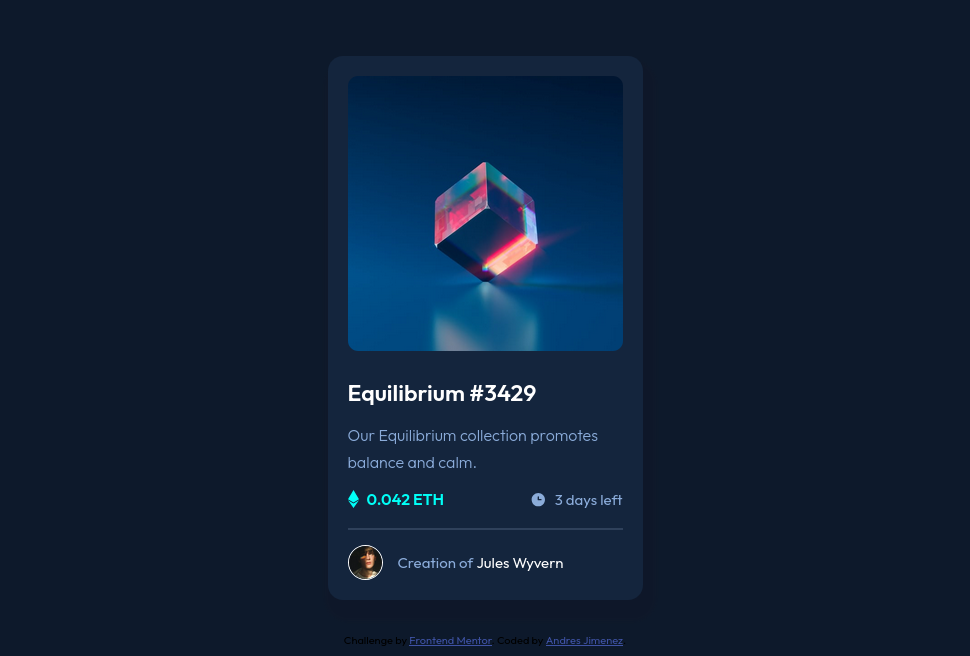

# Frontend Mentor - NFT preview card component solution

This is a solution to the [NFT preview card component challenge on Frontend Mentor](https://www.frontendmentor.io/challenges/nft-preview-card-component-SbdUL_w0U). Frontend Mentor challenges help you improve your coding skills by building realistic projects. 

## Table of contents

- [Overview](#overview)
  - [The challenge](#the-challenge)
  - [Screenshot](#screenshot)
  - [Links](#links)
- [My process](#my-process)
  - [Built with](#built-with)
  - [What I learned](#what-i-learned)
  - [Continued development](#continued-development)
- [Author](#author)

## Overview

### The challenge

Users should be able to:

- View the optimal layout depending on their device's screen size
- See hover states for interactive elements

### Screenshot

### Links

- Solution URL: [https://github.com/andresj24/nft-preview-card-challenge](https://github.com/andresj24/nft-preview-card-challenge)
- Live Site URL: [https://nft-challengeaj.netlify.app/](https://nft-challengeaj.netlify.app/)

## My process

### Built with

- Semantic HTML5 markup
- CSS custom properties
- Flexbox

### What I learned

The most complicated part of this challenge was the positioning and changing the background color of the main image when placing the cursor over it, the positioning of the other elements was completely simple using flexbox.

### Continued development

I am going to focus on continuing to work on absolute and relative positioning in similar projects in order to completely master this knowledge.

## Author

- Frontend Mentor - [@andresj24](https://www.frontendmentor.io/profile/andresj24)

